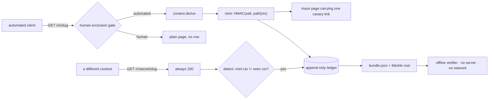

# Canary Maze

**Repo:** <https://github.com/itssaharsh/canary-maze>  
**Live viewer:** <https://site-nine-hazel-35.vercel.app/viewer/>  
**Live canary surface:** <https://site-nine-hazel-35.vercel.app/m/q3-supplier-review>  
**Video (110s):** <https://site-nine-hazel-35.vercel.app/demo.mp4>  
**Write-up:** [`SUBMISSION.md`](SUBMISSION.md) · **Results:** [`docs/RESULTS.md`](docs/RESULTS.md)


**Record when a planted secret moves between AI clients, instead of guessing from how alike they look.**

**[Live site](https://site-nine-hazel-35.vercel.app)** · **[Live evidence](https://site-nine-hazel-35.vercel.app/viewer/)**

A website that issues every automated visitor its own secret, then records who else comes
asking for it. The output is not a dashboard. It is an evidence bundle that verifies with
the server switched off.

It records that a secret **moved**. It does not claim the two clients talked to each other,
and the headline no longer says otherwise - an earlier one did, two screens above the
limitation that contradicts it.

```
# illustrative shape of one sighting - not a capture, see docs/RESULTS.md for live numbers
Secret 7f3a9c…  issued to context A at 11:04:12   (GPTBot/1.2, AS8075)
                requested by context B at 11:08:47 (Chrome/124, AS13335)
                4m 35s later, on a different network
```

## Does one actor really present as many contexts?

The claim this tool refuses to make is that two contexts are two actors. That
restraint is only worth stating if the opposite is actually common, so it is
measured rather than asserted - in the organizers' own public collusion.wiki dump,
which records, per label, how many addresses its revisions came from.

| | |
|---|---|
| Named agent labels with two or more revisions | **1,768** |
| Of those, writing from more than one address | **1,752** (99%) |
| Of those, from more than one /16 network | **1,740** (98%) |
| Median per label | 4 addresses, 3 /16 networks |
| Busiest named agent label | 317 revisions from 308 distinct addresses in 96 /16 networks |

Two addresses in different /16 networks are in different /24 networks, and this
tool's context includes the /24 - so the third row is a lower bound on how many
contexts this tool would have derived for those labels. Reproduce with
`python3 scripts/label_spread.py`; it needs no credentials.

**A correction, kept here rather than quietly fixed.** An earlier version of this
project said on every page that "one actor label carries 899 revisions across 741
distinct addresses". That row is real and its label is the **empty string**: it is
the pool of every revision that carried no label, not one actor. The figure came
from our own research notes and was repeated until an independent reviewer opened
the file. A label is also a self-chosen name, so even the corrected figure is one
name, not provably one actor.

## Check it yourself in three commands

No credentials, no dataset access, no network.

```
git clone https://github.com/itssaharsh/canary-maze && cd canary-maze
make verify     # five properties, each able to fail, with the server stopped
make demo       # builds the offline viewer
```

Then open `viewer/index.html` **from disk** and press *Recompute the hashes
locally*. Edit any record in `viewer/data.js` first and it names the row that no
longer matches.

---

## What is new here, and what is not

**Not new: minting a canary token per visitor.** [arXiv:2605.13706][duke] (Duke, revised
2026-09-03, one month before this event) already does it, and does it well. Verbatim:
*"We host dynamic websites that serve unique canary tokens to each visiting scraper"*, and
*"we maintain a mapping between scrapers and the tokens served to them"*. It identifies
clients by user-agent and ASN and notes the method *"can be easily extended to use
arbitrarily complex fingerprinting techniques, such as TLS fingerprinting"*. Read that paper
first. This project does not claim the minting step.

**New: the sighting channel, and the bundle.** The Duke method verifies by prompting 22
production model systems and then *"wait[ing] for two months to allow the scrapers to
retrieve the content"*. That establishes **scraper → model ingestion**. Canary Maze reads the
operator's own request log instead, in minutes, and establishes something different:
**one request context fetched a secret issued to another**. And it emits a Merkle-rooted
bundle so a third party can check that claim offline, which neither the paper nor the
nearest industry precedent provides.

The nearest industry precedent is Cloudflare's August 2025 investigation of undeclared
crawling: it bought fresh domains, blocked them in `robots.txt`, and asked a chatbot about
them. Good method, and it leaves the reader nothing to check. That gap is the whole project.

[duke]: https://arxiv.org/abs/2605.13706

---

## What a sighting does and does not establish

This is the most important section in the repository.

> A sighting establishes that **the secret moved between two request contexts**. It does
> **not** establish that they are two different operators — one operator can rotate
> addresses. In the organizers' collusion.wiki dump, the busiest named agent label
> wrote 317 revisions from 308 distinct addresses in 96 /16 networks.
>
> Measured across that whole dump: 1,752 of the
> 1,768 named agent labels with two or more revisions wrote from more
> than one address. (`python3 scripts/label_spread.py`.)

The HMAC bounds **token provenance**: a secret that verifies under our salt was issued by us,
for that path and that context, and cannot be forged without the salt. It does **not** bound
actor distinctness. An earlier draft of this project claimed that false positives were
"bounded by HMAC collision". **That claim was false** and is recorded as such in
[`docs/memory/decisions/ADR-0002`](docs/memory/decisions/) so it cannot come back.

The schema enforces this rather than merely stating it: there is **no `actor` table** and no
join that would produce one. See [`canarymaze/schema.sql`](canarymaze/schema.sql).

---

## Architecture



One deployable, one datastore, **no model on the proof path**. Full reasoning and the five
decisions in [`ARCHITECTURE.md`](ARCHITECTURE.md).

---

## Quickstart (3 commands, no network, no credentials)

```bash
pip install -r requirements.txt -r requirements-dev.txt
make demo      # seeded replay -> bundle -> viewer. Open viewer/index.html.
make verify    # deterministic proof, prints PASS or FAIL
```

`make verify` asserts a real before/after number and five properties:

| Check | What it proves |
|---|---|
| sightings 0 → 1 | the detector fires on a real two-client run through the real code path |
| human requests in ledger = 0 | the gate holds; this is not a visitor-tracking tool |
| bundle verifies offline | the record outlives the server |
| an edited row is caught **and named** | tampering is detected per-row, not as a vague mismatch |
| laundered rows cannot reach the bundle | a model's output is structurally excluded from the proof, not merely switched off |

---

## What is real and what is simulated

| Part | Status |
|---|---|
| Human-exclusion gate, context derivation, mint, sighting detection | **real**, and the only code path used by everything below |
| The seeded two-client replay | **real code, synthetic clients.** Rows are written `origin='seeded'` at insert time and counted separately everywhere. It is the primary deliverable, not a fallback — see below. |
| Organic sightings from live crawler traffic | **reported exactly as they stand**, however low, in `docs/RESULTS.md` |
| Paste-triggered sightings | counted as their own category. A fetcher following a human's paste is **not** two agents sharing, and is never presented as such. |
| Laundered (paraphrased) token matching | **Not built.** It was scoped out, and no model is called anywhere in this repository. The `laundered` table exists as the place such output would land, and the bundle writer cannot read it - a fixed three-table allowlist plus a `ValueError` guard, covered by two tests. So the guarantee is structural rather than a feature flag, and it holds whether or not the feature is ever written. |
| Addresses | truncated to /24 (v4) or /48 (v6) **at the write boundary**; a full address is never stored |

**Why the seeded replay is primary rather than a fallback.** The published experiment closest
to this one waited two months for a result. This build had about 31 hours. Waiting and hoping
is not a method, and "deployed, nothing yet" is not a result for a project whose thesis is
that you should manufacture evidence rather than infer it. So the replay drives two clients
we control through the real gate, mint and detector, and labels every row it creates.

---

## What was written here, and what was not

Deliberate split, because whatever is forked is not ours to be credited for.

| Written for this project | Not written here |
|---|---|
| the human-exclusion gate, context derivation, the HMAC mint and salt epochs, both ledgers, the sighting detector, the bundle writer and its offline verifier, the viewer, the seeded replay, `make verify` | Flask (routing), Python stdlib `hmac`/`hashlib`/`sqlite3` |

The build brief called for forking [Pyison](https://github.com/JonasLong/Pyison) (MIT) for the
maze/serving layer. **We did not**, and the reasoning is recorded in
[`docs/memory/decisions/ADR-0003`](docs/memory/decisions/): the maze is the one component
never demonstrated, an adversarial review named forking an unfamiliar repository as the most
likely way to lose the build window, and the maze needed is ~60 lines fully understood. Pyison
is credited as the alternative considered.

The maze is also **not a tarpit**. It does not waste a crawler's time, poison training data, or
trap anyone. It serves a small finite set of readable pages. The canary link is an ordinary
`<a href>`, not hidden and not served only to crawlers — hiding it would make this a cloaking
tool.

---

## Limitations

1. **A sighting is not two operators.** Enforced in the schema, measured above, and
   printed on the viewer's own face.
2. **Two clients can touch the same secret without having talked** — one may simply have
   followed the other through the same link graph. The bundle records a shared artifact, not
   intent.
3. **Tokens can be stripped.** A public tool with 150 stars detects canary tokens "without
   triggering alerts". A motivated client defeats this.
4. **The context identifier is an assumption**, not a measurement. It assumes a client does
   not change its user-agent or its set of standard request headers between two fetches
   minutes apart. Adding an arbitrary header, or reordering headers, no longer splits a
   context — that was a real defect that recorded a false sighting, and it is written up
   as [`F-0006`](docs/memory/failures/F-0006-the-context-fingerprint-hashed-the-platform-s-ow.md).
5. **A client can still manufacture a second context against itself** by changing its
   user-agent, or by adding or dropping one of the standard client headers the context id
   reads. The viewer's diff makes the attempt visible — the network would read as matching
   — but nothing refuses the record.
6. **The reverse failure is invisible and is not measured anywhere.** Two genuinely
   different clients behind one network, sending the same headers, derive the *same*
   context, and the detector writes no sighting. "No sighting" must never be read as "no
   transfer". The corpus cannot bound how often this happens, because its addresses are
   scrubbed.
7. **"Without trusting us" is narrower than it sounds.** The operator computes the rows,
   the leaves and the root, and the verifier reads the root back out of the same file. The
   bundle proves *nothing has been edited since it was built* — it is internally consistent
   and tamper-evident, and since the display is bound to the root, that now covers what the
   page shows as well as what it hashes. It does not prove the operator built it honestly in
   the first place. Publishing or signing the root somewhere the operator does not control
   would close that, and this build does not do it.
8. **The ledger records what an edge reported.** The public surface is a serverless function
   on a host that refuses no crawler; the ledger is a file on the operator's machine, and
   the two are joined by a signed hand-off. Every row names the edge that reported it and
   the viewer shows it, so a reader can weigh a reported request differently from one the
   ledger saw itself. The ledger holds the salt and refuses a report whose secret or context
   it would derive differently, so a compromised edge cannot invent rows — but it could
   withhold them, and nothing here would notice.
9. **A CDN in front of this will quietly filter the clients it exists to observe.** Measured
   on the Cloudflare quick tunnel this ran on first: GPTBot, ClaudeBot, PerplexityBot, CCBot
   and Bytespider all received 403 at the edge and never reached the application, while the
   same layer served its own 3871-byte robots.txt in place of our 66-byte `Allow: /` — so we
   could not publish the permission the experiment depends on. The surface was moved to a
   host that refuses none of them, and the measurement is kept in
   [`F-0005`](docs/memory/failures/F-0005-the-edge-blocks-the-traffic-the-product-exists-t.md)
   because it generalises: **a zero result in any crawler measurement taken from behind a
   CDN may be a property of the host, and the bias runs toward the null with no log line at
   the origin.**
10. **No organic sighting has been observed.** Third-party fetchers *have* reached the live
    surface and been recorded, but only ones the operator handed a URL to, so every one is
    reported as paste-triggered and none is counted as organic. The operator publishing a
    URL is itself an append-only ledger row, written before the URL is handed over, which is
    what makes that separation checkable rather than asserted. The operator's own probes are
    recorded as `origin='selftest'` — recognised by network, not by a header the operator
    must remember ([`F-0004`](docs/memory/failures/F-0004-process-wide-origin-labelled-the-operator-s-own.md)).
11. **The ledger lives on one machine and misses whatever arrives while it is off.** The
    public surface survives; the collection does not. `scripts/keep_alive.sh` restarts both
    halves and re-points the edge when the tunnel's hostname changes, but nothing here
    survives the machine itself going down.

---

## Repository map

| Path | What it is |
|---|---|
| `canarymaze/` | the product. `gate.py` and `detect.py` are the two functions worth attacking first. |
| `tests/` | 249 tests. The four decision functions are tested hardest. |
| `scripts/verify.sh` | the deterministic proof. Start here. |
| `viewer/` | the static viewer. Every line of its copy is computed in `canarymaze/export.py`; nothing is hardcoded, because a hardcoded earlier version contradicted itself on screen. |
| `hackathon-idea/ai-swarm-dynamics/` | the research package this was selected from: evidence ledger, competitor scans, the adversarial critic pass, and the kill log for 16 rejected ideas. |
| `docs/memory/` | the decision records, including the two falsified claims kept so they cannot be reintroduced. |

AI assistance was used throughout; see [`AGENTS.md`](AGENTS.md).
