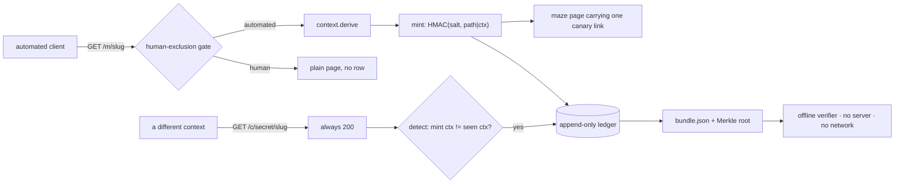

# Canary Maze

**Record when a planted secret moves between AI clients, instead of guessing from how alike they look.**

**[Live site](https://site-nine-hazel-35.vercel.app)** · **[Live evidence](https://site-nine-hazel-35.vercel.app/viewer/)**

A website that issues every automated visitor its own secret, then records who else comes
asking for it. The output is not a dashboard. It is an evidence bundle that verifies with
the server switched off.

It records that a secret **moved**. It does not claim the two clients talked to each other,
and the headline no longer says otherwise - an earlier one did, two screens above the
limitation that contradicts it.

```
Secret 7f3a9c…  issued to context A at 11:04:12   (GPTBot/1.2, AS8075)
                requested by context B at 11:08:47 (Chrome/124, AS13335)
                4m 35s later, on a different network
```

---

## What is new here, and what is not

**Not new: minting a canary token per visitor.** [arXiv:2605.13706][duke] (Duke, revised
2026-09-03, one month before this event) already does it, and does it well. Verbatim:
*"We host dynamic websites that serve unique canary tokens to each visiting scraper"*, and
*"we maintain a mapping between scrapers and the tokens served to them"*. It identifies
clients by user-agent and ASN and notes the method *"can be easily extended to use
arbitrarily complex fingerprinting techniques, such as TLS fingerprinting"*. Read that paper
first. This project does not claim the minting step.

**New: the sighting channel, and the bundle.** The Duke method verifies by prompting 22
production model systems and then *"wait[ing] for two months to allow the scrapers to
retrieve the content"*. That establishes **scraper → model ingestion**. Canary Maze reads the
operator's own request log instead, in minutes, and establishes something different:
**one request context fetched a secret issued to another**. And it emits a Merkle-rooted
bundle so a third party can check that claim offline, which neither the paper nor the
nearest industry precedent provides.

The nearest industry precedent is Cloudflare's August 2025 investigation of undeclared
crawling: it bought fresh domains, blocked them in `robots.txt`, and asked a chatbot about
them. Good method, and it leaves the reader nothing to check. That gap is the whole project.

[duke]: https://arxiv.org/abs/2605.13706

---

## What a sighting does and does not establish

This is the most important section in the repository.

> A sighting establishes that **the secret moved between two request contexts**. It does
> **not** establish that they are two different operators — one operator can rotate
> addresses. In the AI Village dump, one actor label spans **741** of them.

The HMAC bounds **token provenance**: a secret that verifies under our salt was issued by us,
for that path and that context, and cannot be forged without the salt. It does **not** bound
actor distinctness. An earlier draft of this project claimed that false positives were
"bounded by HMAC collision". **That claim was false** and is recorded as such in
[`docs/memory/decisions/ADR-0002`](docs/memory/decisions/) so it cannot come back.

The schema enforces this rather than merely stating it: there is **no `actor` table** and no
join that would produce one. See [`canarymaze/schema.sql`](canarymaze/schema.sql).

---

## Architecture



One deployable, one datastore, **no model on the proof path**. Full reasoning and the five
decisions in [`ARCHITECTURE.md`](ARCHITECTURE.md).

---

## Quickstart (3 commands, no network, no credentials)

```bash
pip install -r requirements.txt -r requirements-dev.txt
make demo      # seeded replay -> bundle -> viewer. Open viewer/index.html.
make verify    # deterministic proof, prints PASS or FAIL
```

`make verify` asserts a real before/after number and five properties:

| Check | What it proves |
|---|---|
| sightings 0 → 1 | the detector fires on a real two-client run through the real code path |
| human requests in ledger = 0 | the gate holds; this is not a visitor-tracking tool |
| bundle verifies offline | the record outlives the server |
| an edited row is caught **and named** | tampering is detected per-row, not as a vague mismatch |
| laundered rows cannot reach the bundle | a model's output is structurally excluded from the proof, not merely switched off |

---

## What is real and what is simulated

| Part | Status |
|---|---|
| Human-exclusion gate, context derivation, mint, sighting detection | **real**, and the only code path used by everything below |
| The seeded two-client replay | **real code, synthetic clients.** Rows are written `origin='seeded'` at insert time and counted separately everywhere. It is the primary deliverable, not a fallback — see below. |
| Organic sightings from live crawler traffic | **reported exactly as they stand**, however low, in `docs/RESULTS.md` |
| Paste-triggered sightings | counted as their own category. A fetcher following a human's paste is **not** two agents sharing, and is never presented as such. |
| Laundered (paraphrased) token matching | **Not built.** It was scoped out, and no model is called anywhere in this repository. The `laundered` table exists as the place such output would land, and the bundle writer cannot read it - a fixed three-table allowlist plus a `ValueError` guard, covered by two tests. So the guarantee is structural rather than a feature flag, and it holds whether or not the feature is ever written. |
| Addresses | truncated to /24 (v4) or /48 (v6) **at the write boundary**; a full address is never stored |

**Why the seeded replay is primary rather than a fallback.** The published experiment closest
to this one waited two months for a result. This build had about 31 hours. Waiting and hoping
is not a method, and "deployed, nothing yet" is not a result for a project whose thesis is
that you should manufacture evidence rather than infer it. So the replay drives two clients
we control through the real gate, mint and detector, and labels every row it creates.

---

## What was written here, and what was not

Deliberate split, because whatever is forked is not ours to be credited for.

| Written for this project | Not written here |
|---|---|
| the human-exclusion gate, context derivation, the HMAC mint and salt epochs, both ledgers, the sighting detector, the bundle writer and its offline verifier, the viewer, the seeded replay, `make verify` | Flask (routing), Python stdlib `hmac`/`hashlib`/`sqlite3` |

The build brief called for forking [Pyison](https://github.com/JonasLong/Pyison) (MIT) for the
maze/serving layer. **We did not**, and the reasoning is recorded in
[`docs/memory/decisions/ADR-0003`](docs/memory/decisions/): the maze is the one component
never demonstrated, an adversarial review named forking an unfamiliar repository as the most
likely way to lose the build window, and the maze needed is ~60 lines fully understood. Pyison
is credited as the alternative considered.

The maze is also **not a tarpit**. It does not waste a crawler's time, poison training data, or
trap anyone. It serves a small finite set of readable pages. The canary link is an ordinary
`<a href>`, not hidden and not served only to crawlers — hiding it would make this a cloaking
tool.

---

## Limitations

1. **A sighting is not two operators.** Stated above, enforced in the schema, and printed on
   the viewer's own face.
2. **Two clients can touch the same secret without having talked** — one may simply have
   followed the other through the same link graph. The bundle records a shared artifact, not
   intent.
3. **Tokens can be stripped.** A public tool with 150 stars detects canary tokens "without
   triggering alerts". A motivated client defeats this.
4. **The context identifier is an assumption**, not a measurement: it assumes a client does
   not vary its user-agent, network and header order between two fetches minutes apart.
5. **Organic results depend on traffic we do not control**, which is exactly why the seeded
   replay exists and is labelled.
6. **"Without trusting us" is narrower than it sounds.** The operator computes the rows,
   the leaves and the root, and the verifier reads the root back out of the same file. What
   the bundle proves is that *nothing has been edited since it was built* - it is internally
   consistent and tamper-evident. It does not prove the operator built it honestly in the
   first place. Publishing or signing the root somewhere the operator does not control would
   close that, and this build does not do it.
7. **A determined client can manufacture a second context against itself.** The context id
   includes the order of header names, so one client adding a single header (`X-Trace: 1`)
   on its second request presents as a different context and produces a sighting. The
   viewer's diff makes this visible - user-agent and network would both read as matching -
   but nothing refuses the record. Treat a sighting whose only difference is header order
   as weak.
8. **The host blocks half the clients this is meant to observe.** Behind a Cloudflare
   quick tunnel, GPTBot, ClaudeBot, PerplexityBot, CCBot and Bytespider all receive 403
   at the edge and never reach the application; ChatGPT-User, OAI-SearchBot and Googlebot
   pass. The same layer replaces our 66-byte `Allow: /` robots.txt with 3871 bytes of its
   own policy, so we cannot publish the permission the experiment depends on. A zero
   organic count is therefore partly a measurement of the host (`docs/RESULTS.md`,
   `docs/memory/failures/F-0005`).
9. **The live ledger contains no third-party traffic yet.** Every row in it so far was
   generated by the builder. `docs/RESULTS.md` says so, and is generated from the ledgers
   rather than typed, so it cannot drift from them; no number anywhere should be read as
   organic observation until that file says otherwise. The builder's own probes are now
   recorded as `origin='selftest'` and counted separately, because an earlier build stamped
   one origin per process and published a verification `curl` as an organic sighting
   (`docs/memory/failures/F-0004`). The token that marks them is secret on purpose: if the
   header alone were enough, a fetcher could label itself a self-test and opt out of being
   observed.

---

## Repository map

| Path | What it is |
|---|---|
| `canarymaze/` | the product. `gate.py` and `detect.py` are the two functions worth attacking first. |
| `tests/` | 117 tests. The four decision functions are tested hardest. |
| `scripts/verify.sh` | the deterministic proof. Start here. |
| `viewer/` | the static viewer. Every line of its copy is computed in `canarymaze/export.py`; nothing is hardcoded, because a hardcoded earlier version contradicted itself on screen. |
| `hackathon-idea/ai-swarm-dynamics/` | the research package this was selected from: evidence ledger, competitor scans, the adversarial critic pass, and the kill log for 16 rejected ideas. |
| `docs/memory/` | the decision records, including the two falsified claims kept so they cannot be reintroduced. |

AI assistance was used throughout; see [`AGENTS.md`](AGENTS.md).
